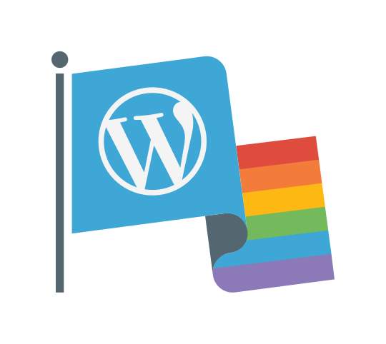

# WordPress Pride Flags 🏳️‍🌈 🎉

Create your own downloadable WordPress pride flag SVG.



There are some predefined pride flags already configured, or you can customize
your own with as many rows as you want. There are some colors preset that work
well together, or you can set your own colors using hex codes or `rgb()`.

The pre-set flags are:

* Agender
* Aromantic
* Asexual
* Bisexual
* Gay #MoreColorMorePride
* Gay (Rainbow)
* Genderfluid
* Genderqueer
* Nonbinary
* Pansexual
* Polysexual
* Transgender

## Development

To run this locally, you can clone and install the repo with the following
commands

```
git clone git@github.com:ryelle/queeromattic-flags.git
cd queeromattic-flags
npm install
npm start
```

Now you can open `http://localhost:3000` to see the app. This does not
live-reload, if you make any changes you'll need to halt and restart the
process.

If you want to keep watch of your files while working, you can run `npm run
watch`. This runs off a webpack server, rather than the express server, so
downloading the SVGs won't work with this method.

### CSS

The CSS is generated from the Sass files in `src/scss`, if you want to update
styles, do so in these files, not the generated `style.css` file.

## Credits

Original Queeromattic flag by @hugobaeta, with bisexual and transgender
variations by @melchoyce. Other color combos and the rest of the app by @ryelle.

This project was created using create-react-app, Sass, and SVG magic ✨
